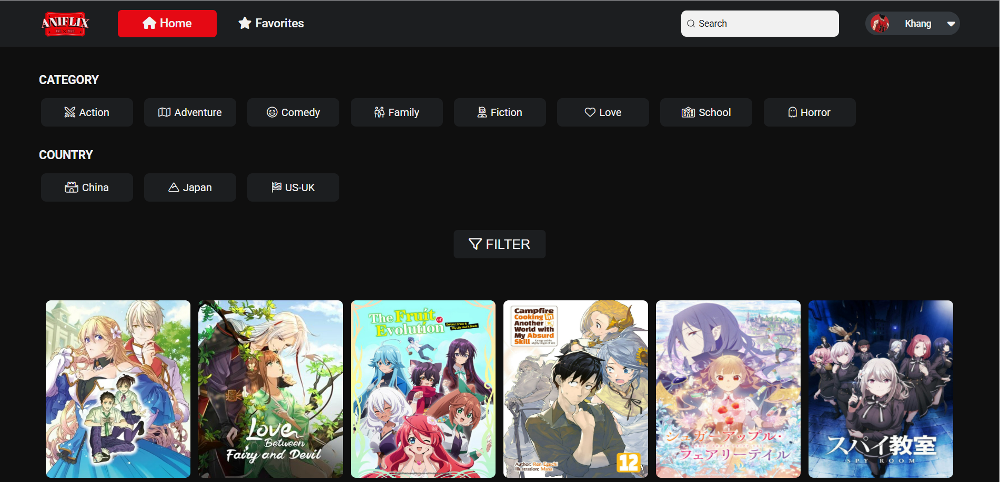
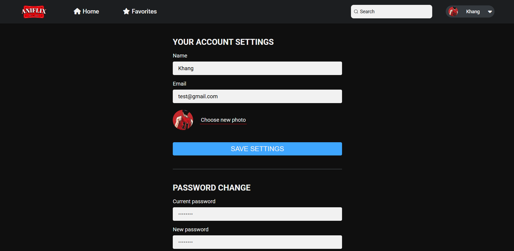

# Aniflix - Anime Streaming Application

An anime streaming application using expressjs, mongoose and more. 😉

## ✨ Features

### User Management

- **Authentication**: Secure login/register with email & password
- **Profile Customization**:
  - Update username, email, and avatar
  - Change password

### Anime Features

- **Mark anime as favorite**:
  - Add anime to your favorite list
  - Remove anime from your favorite list
  - View your favorite anime list
- **Search anime**:
  - Search for anime by title
  - View anime details
- **Filter anime**:
  - Filter anime by genre
  - Filter anime by country
- **Anime List**:
  - View all anime list
  - View anime details
  - View anime episodes
  - Anime pagination
- **Suggest similar anime**

## 🛠 Tech Stack

**Frontend**:

- HTML
- CSS
- JavaScript

**Backend**:

- Node.js
- Express.js
- Mongoose
- MongoDB

## 📸 Application Screens

**Home**

**Settings**

